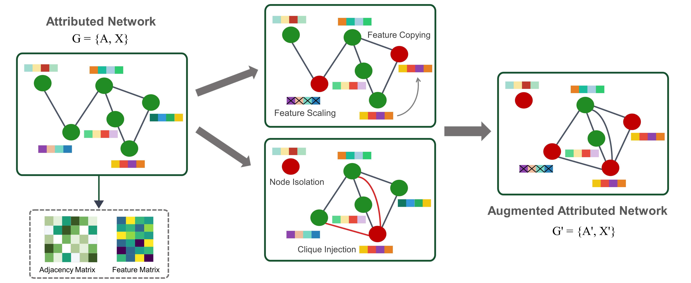
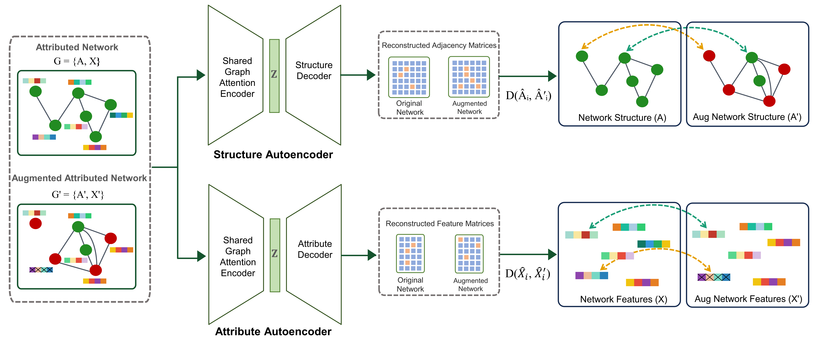

# Dual contrastive learning-based reconstruction for anomaly detection in attributed networks (DCOR)

Official implementation of **DCOR**, which uses dual autoencoders with reconstruction-level contrast (RLC) for anomaly detection in attributed graphs.

## Overview

<p align="center">
  
</p>

From an attributed network, we generate augmented views using structural operations (node isolation, clique injection) and attribute operations (scaling, copying, masking).

---

<p align="center">
  
</p>

A shared GAT encoder produces embeddings used by two decoders: an inner-product structure decoder and a linear attribute decoder.
Reconstruction-level contrast (RLC) aligns reconstructions for unperturbed nodes and enforces a margin for perturbed nodes, driving anomaly separation.

---

## Install
```bash
python -m venv .venv && source .venv/bin/activate  # Windows: .venv\Scripts\activate
pip install -r requirements.txt


## Datasets
Place raw files under `data/raw/<dataset>/` (e.g., `.mat` or `.npz` containing `A`, `X`, and optionally `y`). Use the helper to convert `.mat` to `.npz`:
```bash
python scripts/process_mat_to_npz.py --in data/raw/amazon/amazon.mat --out data/processed/amazon.npz
```

## Quick Start (Amazon)
```bash
python train.py --dataset amazon --config configs/amazon.yaml
python eval.py  --dataset amazon --ckpt outputs/amazon/best.ckpt
```

## Key ideas
- Shared GNN encoder; structure decoder (inner product) + attribute decoder (linear).
- Reconstruction-level contrast with **learnable margin `m`**.
- Configurable **augmentation budgets** for structure/features.
- AUROC-based evaluation with paper-style anomaly score.
