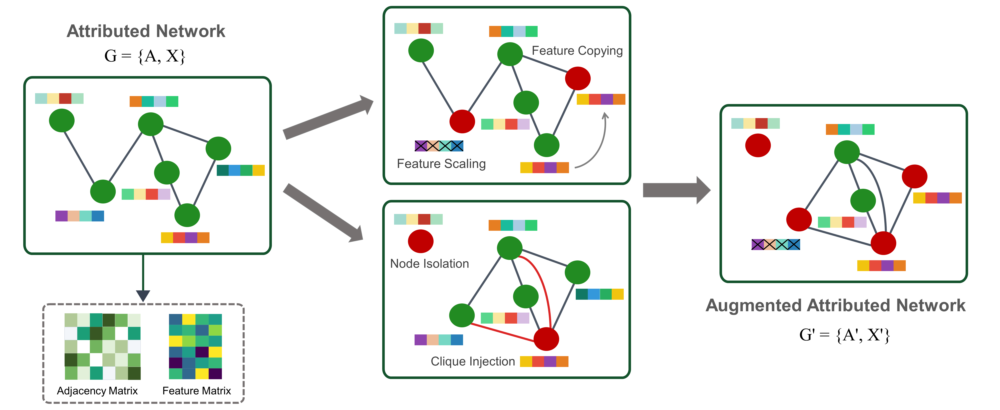
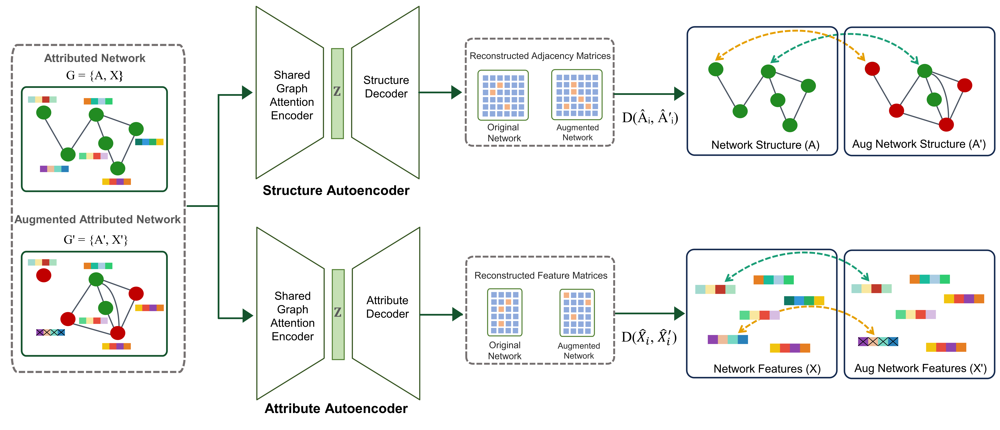

# Dual contrastive learning-based reconstruction for anomaly detection in attributed networks (DCOR)

Official implementation of **DCOR**, which uses dual autoencoders with reconstruction-level contrast (RLC) for anomaly detection in attributed graphs.

## Overview

<p align="center">
  
</p>

From an attributed network, we generate augmented views using structural operations (node isolation, clique injection) and attribute operations (scaling, copying, masking).

---

<p align="center">
  
</p>

A shared GAT encoder produces embeddings used by two decoders: an inner-product structure decoder and a linear attribute decoder.
Reconstruction-level contrast (RLC) aligns reconstructions for unperturbed nodes and enforces a margin for perturbed nodes, driving anomaly separation.

---

## Install
```bash
python -m venv .venv && source .venv/bin/activate  # Windows: .venv\Scripts\activate
pip install -r requirements.txt


## Datasets
Place raw files under `data/raw/<dataset>/` (e.g., `.mat` or `.npz` containing `A`, `X`, and optionally `y`). Use the helper to convert `.mat` to `.npz`:
```bash
python scripts/process_mat_to_npz.py --in data/raw/amazon/amazon.mat --out data/processed/amazon.npz
```

### Dataset statistics (Table 3)

**Table 3 (paper):** Summary of the datasets used—node/edge/feature counts, domain, and anomaly ratio.

<p align="center">
  
</p>

| Dataset  | Nodes | Edges   | Attributes | Domain              | Anomaly |
|:--------:|------:|--------:|-----------:|---------------------|--------:|
| Enron    | 13,533| 176,987 | 18         | Email network       | 0.04%   |
| Amazon   | 1,418 | 3,695   | 21         | Co-purchase network | 1.97%   |
| Facebook | 4,039 | 88,234  | 576        | Social network      | 9.9%    |
| Flickr   | 7,575 | 239,738 | 12,407     | Social network      | 5.9%    |
| ACM      | 16,484| 71,980  | 8,337      | Citation network    | 3.6%    |
| Reddit   | 10,984| 168,016 | 64         | Discussion forum    | 3.3%    |


## Quick Start (Amazon)
```bash
python train.py --dataset amazon --config configs/amazon.yaml
python eval.py  --dataset amazon --ckpt outputs/amazon/best.ckpt
```

## Key ideas
- Shared GNN encoder; structure decoder (inner product) + attribute decoder (linear).
- Reconstruction-level contrast with **learnable margin `m`**.
- Configurable **augmentation budgets** for structure/features.
- AUROC-based evaluation with paper-style anomaly score.
